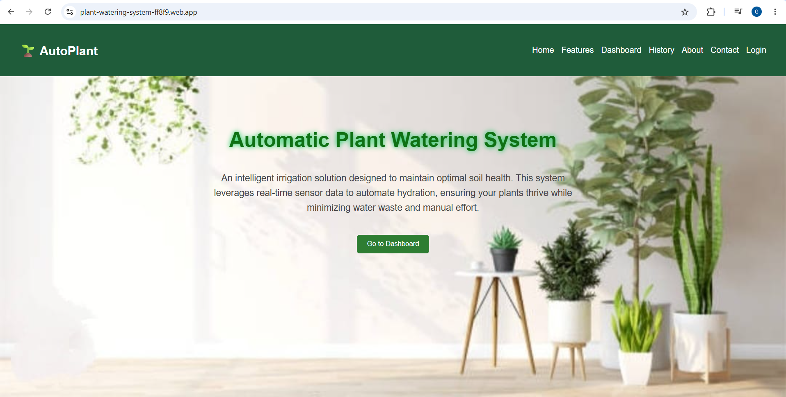
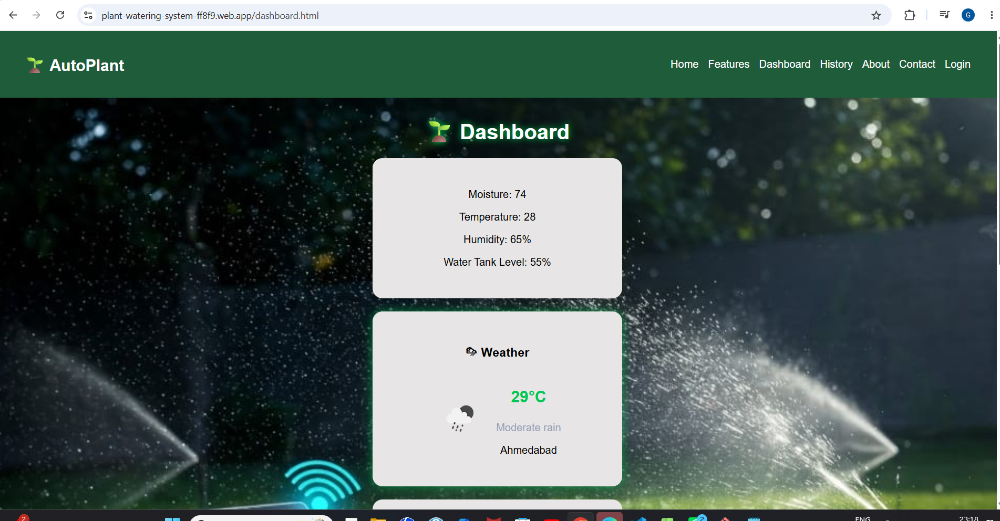
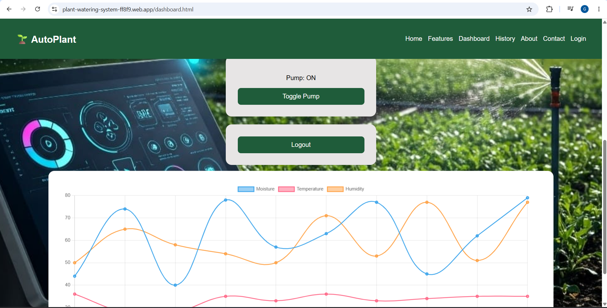
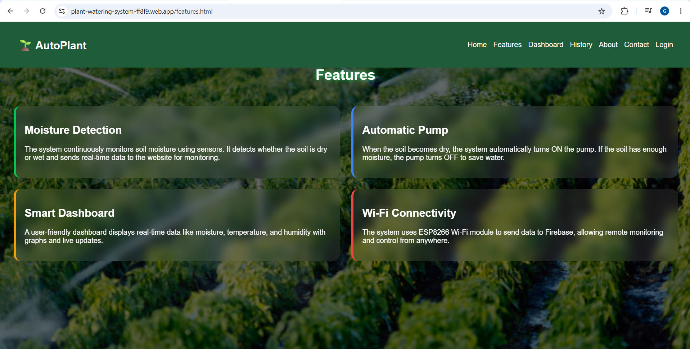
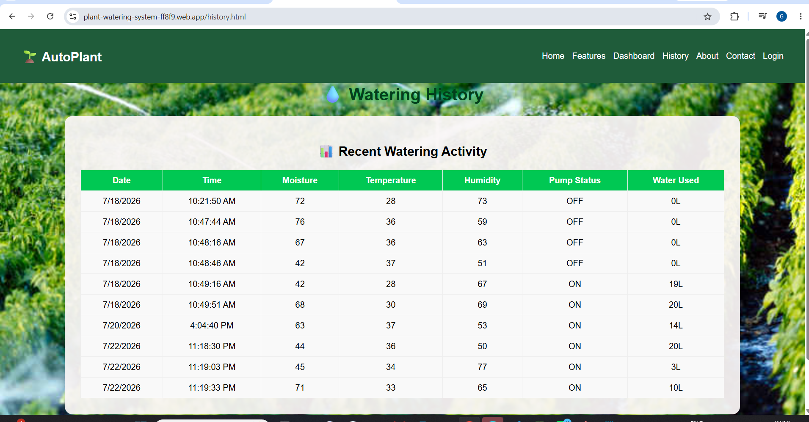
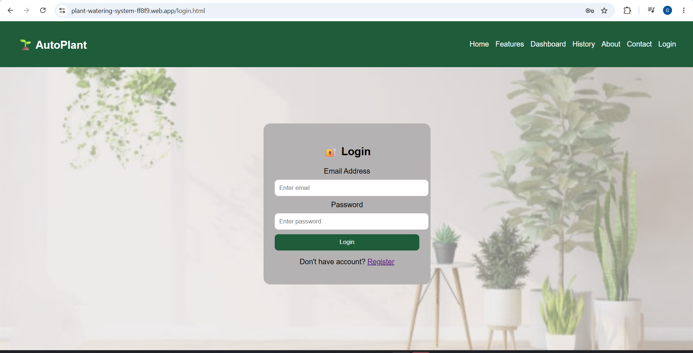
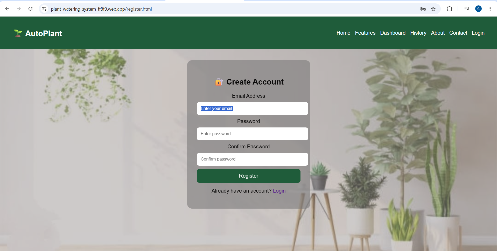

# 🌱 AutoPlant – Smart Automatic Plant Watering System

## 📖 Project Overview

AutoPlant is an IoT-inspired smart irrigation monitoring system designed to help users monitor plant conditions and automate watering decisions through a web-based dashboard.

The application uses Firebase for user authentication and real-time data management and is designed to work with an ESP8266-based plant monitoring system.

---

## 🎯 Project Objectives

- Reduce manual plant watering.
- Monitor plant conditions remotely.
- Display real-time environmental data.
- Store historical sensor records.
- Provide automatic and manual irrigation control.

---

## ✨ Key Features

- 🔐 User Registration & Login
- 🌱 Soil Moisture Monitoring
- 🌡 Temperature Monitoring
- 💧 Humidity Monitoring
- ☁ Weather Information
- 🚰 Automatic Pump Control
- 👆 Manual Pump Control
- 📊 Live Dashboard
- 📜 History of Sensor Data
- 🔥 Firebase Authentication
- ☁ Firebase Realtime Database
- 📱 Responsive User Interface

---

## 🛠 Technologies Used

### Frontend
- HTML5
- CSS3
- JavaScript

### Backend & Database
- Firebase Authentication
- Firebase Realtime Database

### IoT Concept
- ESP8266
- Arduino IDE

### Deployment
- Firebase Hosting

---

## 🌐 Live Demo

🔗 https://plant-watering-system-ff8f9.web.app

---

## 📂 Project Structure

```
AutoPlant-Smart-Irrigation-System/
│
├── index.html
├── about.html
├── contact.html
├── dashboard.html
├── features.html
├── history.html
├── login.html
├── register.html
├── style.css
├── script.js
├── images/
└── screenshots/
```

---

## 📸 Screenshots

### 🏠 Home Page



---

### 📊 Dashboard




---

### ✨ Features



---

### 📜 History



---

### 🔐 Login Page



---

### 🔐 Register Page



---

## 🚀 Future Improvements

- Mobile application
- Multi-plant monitoring
- Email/SMS notifications
- Physical ESP8266 hardware integration
- AI-based watering recommendations

---

## 👩‍💻 Developed By

**Shivani Girase**

Bachelor of Engineering (Computer Engineering)

Passionate about Web Development, IoT and Data Analytics.
